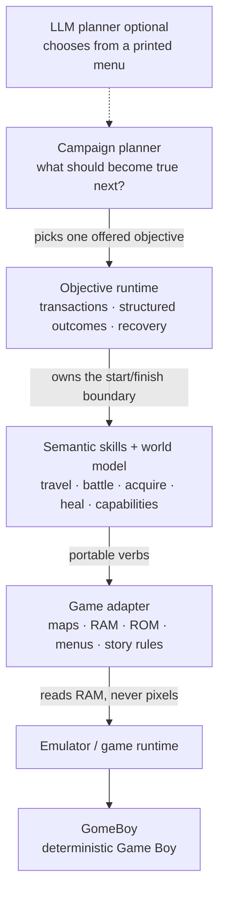
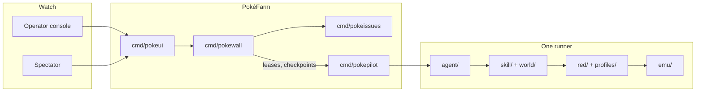

# PokePilot

PokePilot is a long-running game-playing runtime. It boots a real ROM in a
deterministic emulator, drives the game with typed semantic objectives, and
measures how far a planner can get. Pokémon Red is the first game adapter, not
the intended permanent boundary of the core.

Gameplay truth comes from RAM, never from pixels. Every round is logged. Every
run is reproducible to the bit.

The binding design contract is [`docs/ARCHITECTURE.md`](docs/ARCHITECTURE.md):
generic layers own semantics and lifecycle; a game adapter owns maps, RAM, menus,
dialogue, and story mechanics.

## Architecture

The conceptual stack, from [`docs/ARCHITECTURE.md`](docs/ARCHITECTURE.md):



Red is the first adapter behind that boundary (`red/`, `profiles/`). Adding
Crystal or Emerald should mean a new adapter and game facts, not a fork of the
planner or recovery policy.

How that maps onto this repo and the farm:



| Layer | Packages |
|---|---|
| Portable contract | `game/` — objective transactions; must not import Red, emu, skill, or world |
| Campaign planner | `agent/`, `cmd/pokepilot` |
| Skills and navigation | `skill/`, `world/` |
| Red adapter | `red/rom`, `red/state`, `red/sym`, `red/profile`, `profiles/` |
| Emulator | `emu/` — the only package that talks to [GomeBoy](https://github.com/maestroi/gomeboy) |
| Farm | `farm/`, `cmd/pokewall`, `cmd/pokeui`, `cmd/pokeissues` |

If a gameplay fix does not fit that split, do not force it into the current
layer. Reshape the boundary first. See [`docs/ARCHITECTURE.md`](docs/ARCHITECTURE.md).

## Why it is built this way

- **Determinism is the point.** Gen 1's RNG is reseeded from the CPU cycle
  count (`rDIV`). Nothing in the loop reads a wall clock, so the same ROM and
  the same inputs meet the same Pidgey on the same tile. `-seed N` burns
  N-derived idle frames after boot to get *different* luck, not a fair
  comparison.
- **No pixels.** The browser view is for humans to watch. Assertions read
  `red/state` (a RAM snapshot decoded into typed state) and cannot flake on a
  frame.
- **The decomp is vendored.** `pokered/` is the full pokered decompilation,
  byte-identical to `roms/pokemon_red.gb` (sha1
  `ea9bcae617fdf159b045185467ae58b2e4a48b9a`). `docs/POKERED.md` maps question →
  file.
- **Endless runs discover; replays prevent regressions.** The farm finds
  failures. A cheap deterministic replay keeps them fixed. Details in
  [`docs/ARCHITECTURE.md`](docs/ARCHITECTURE.md).

## Layout

| Path | What it is |
|---|---|
| `game/` | Portable objective runtime and adapter contract |
| `emu/` | Open, step, input, save states, watch |
| `red/` | ROM tables, RAM decode, symbols, Red profile |
| `world/` | Map graph, collision grids, BFS pathfinding |
| `skill/` | Deterministic executors plus the fixture cache and probe |
| `agent/` | Objectives, observation, planner loop |
| `farm/` | Lease/spec types shared by runners and the wall |
| `cmd/pokepilot` | Main binary: ROM, HTTP screen, scripted or llm planner |
| `cmd/badgerun` | Scoreboard harness to the Boulder Badge |
| `cmd/pokewall` | Farm orchestrator |
| `cmd/pokeui` | Operator console; the browser talks only to this |
| `pokered/` | Vendored decompilation — `pokered/UPSTREAM.md` |
| `deploy/` | Docker image and Swarm stack (`deploy/README.md`) |
| `docs/` | Architecture, agent loop, decomp map, plans |
| `roms/` | Gitignored; your ROM lives here |

## Getting started

Requires Go 1.26 and a Pokémon Red ROM for gameplay. GomeBoy is pinned in
`go.mod` to the PokePilot-maintained fork at `github.com/maestroi/gomeboy`.
ROM-free verification also works without a ROM.

```sh
export POKEMON_RED_ROM=roms/pokemon_red.gb   # roms/ is gitignored
make run                                      # scripted: boot, take the starter, walk to -goto
make run ARGS='-goto "pallet town"'
```

The screen is served at `http://localhost:8099` for humans to watch.

### LLM planner

```sh
make run-llm        # sources .env for llm_token
make run-llm-local  # same loop against a local model, thinking disabled
make run-llm-auto   # prefer local GPU; pin the configured fallback on transport failure
```

Environment: `POKEPILOT_LLM_URL` (default `http://192.168.50.204:8000/v1`),
`POKEPILOT_LLM_MODEL` (default `qwen3.5-4b`), `llm_token` from `.env`. The
`run-llm-auto` target additionally understands `POKEPILOT_LLM_FALLBACK_URL`,
`POKEPILOT_LLM_FALLBACK_MODEL`, `POKEPILOT_LLM_FALLBACK_TOKEN`,
`POKEPILOT_LLM_FALLBACK_TIMEOUT`, and the `AUTO_LLM_*` Make overrides. A
primary transport failure pins the fallback for the rest of the run; ordinary
model rejection/retry does not switch backends.

`-goal` accepts ordinary prompt text, but four structured forms are evaluated
against decoded game state before each model call and stop deterministically
when complete: `badges:N`, `reach:<place>`, `level:N`, `item:<name>`, plus the
`elite-four` goal. For example:

```sh
make run-llm ARGS='-goal badges:1'
make run-llm-auto ARGS='-goal "reach:pewter city"'
```

The default is `elite-four`. Nothing reaches the Champion yet, so a default
run ends on the round cap rather than on success, and each round carries its
own progress ("badges N/8") into the planner's prompt. Use `-goal badges:1`
for a short run that can actually finish.

Each round the model picks one of the offered objectives, and the round is
printed to stdout. The run stops on structured-goal completion, budget
exhaustion, a reply naming no objective, or a failed objective. Details in
`docs/AGENT.md`.

### Scoreboard

```sh
POKEMON_RED_ROM=roms/pokemon_red.gb \
    go run ./cmd/badgerun -starter all -n 3 -seeds 1,2,3
```

Per run it reports badge yes/no, frames to badge (emulated frames, never
wall clock), planner calls, battles, blackouts, and where the run stopped.
It is a harness, not a service — not part of `go test ./...`.

## Testing

```sh
make verify         # ROM-free: module graph, vet, short tests, race tests
make test           # full go test ./...; ROM-backed tests skip without ROM
```

- `world` and `red/rom` tests are pure ROM-byte tests: milliseconds, no
  emulator, cannot flake.
- `skill` journey tests boot the emulator from cached fixtures — save states
  generated on demand from your ROM under `skill/testdata/fixtures/`
  (gitignored; set `POKEPILOT_FIXTURE_DIR` to share a cache). Emulator tests
  skip when `POKEMON_RED_ROM` is unset.
- A failing journey test dumps its final save state to
  `skill/failure/<TestName>.state`. Re-running a journey test is **not**
  reproducing it: the RNG is seeded from the cycle count, so the second run
  is a different game. Read the dump instead:

  ```sh
  PROBE_STATE=failure/TestGymBoulderBadge.state \
      go test ./skill -run '^TestProbe$' -v
  ```

## The probe

`skill.TestProbe` answers geometry questions without reading a collision
grid into context:

```sh
POKEMON_RED_ROM=roms/pokemon_red.gb PROBE_MAP=0x0c PROBE_AT=15,13 \
    go test ./skill -run '^TestProbe$' -v
```

`PROBE_TO`, `PROBE_BLOCK`, `PROBE_ROUTE`, and `PROBE_STATE` extend it.
`AGENTS.md` is the canonical reference for working on this repo.

## The farm

`make farm-up` builds the image and deploys a local single-node Docker
Swarm: one wall (orchestrator), one UI (operator console at
`http://localhost:18080`), two runners. `make farm-down` tears it down. CI
on `main` publishes `ghcr.io/maestroi/pokepilot` for multi-node Swarms.
Details in `deploy/README.md`.

## Documentation

| Doc | What it answers |
|---|---|
| `AGENTS.md` | Binding working rules for coding agents, probes, decomp/RNG/fixture discipline |
| `docs/ARCHITECTURE.md` | Binding multi-game architecture: principles, layering, and the design gate for every runtime fix |
| `docs/AGENT.md` | The agent loop, ROM facts, badgerun, farm evidence |
| `docs/GAME_PROFILES.md` | Portable `game.GameProfile` contract and Red as the first profile |
| `docs/POKERED.md` | Question → file map for the vendored decomp |
| `docs/DEVELOPMENT.md` | ROM-free vs ROM-backed workflow |
| `docs/QUALIFICATION.md` | ROM-backed qualification catalog and private corpus |
| `docs/MCP.md` | Remote MCP control plane |
| `docs/SPECTATOR.md` | Public read-only spectator mode |
| `docs/RAM_FORENSICS.md` | Failure RAM capture |
| `docs/S3_ARTIFACT_STORAGE.md` | Farm artifact object storage |
| `docs/RUN_INSPECTOR.md` | Run inspector, artifacts, and deterministic replay |
| `docs/PORTABLE_REPRO.md` | Portable reproduction bundles |
| `docs/ROAD-TO-ELITE-FOUR.md` | Everything between Cerulean City and the Pokémon League |
| `docs/RUNNOTES.md` | Permanent per-task measurements |
| `RUNNOTES.md` | Short handoff for the next task |
| `docs/plans/` | In-flight implementation plans only |
| `docs/archive/` | Implemented plans, designs, slice notes, and issue writeups |

## House rules

- Never commit a ROM or any `.gb` / `.sav` / `.state` file.
- Coordinates come from `skill.Place`, never literals.
- Use `Travel`, not `GoTo`, for anything crossing tall grass.
- Event flag indices come from `state.Event`, never from counting `const`
  lines.

The full list, with the reasoning, is in `AGENTS.md`. The architecture rules
that determine where a fix belongs are in `docs/ARCHITECTURE.md`.
